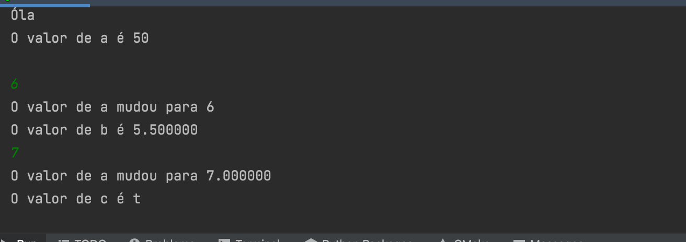

<h1 align="center">
    
</h1>

Practicas em linguagem C

📌 Practicando Variaveis em C
------------------
Practicas e Exercicios de programação em linguagem C

🔧 Tecnologias utilizadas:
------------------

- <strong>Liguagem C</strong>
- <strong>JetBrains</strong>
- <strong>Clion</strong>

💬 Fale comigo
------------------
[*Entre em contato comigo*](https://www.linkedin.com/in/ivo-baptista-3712144/)

